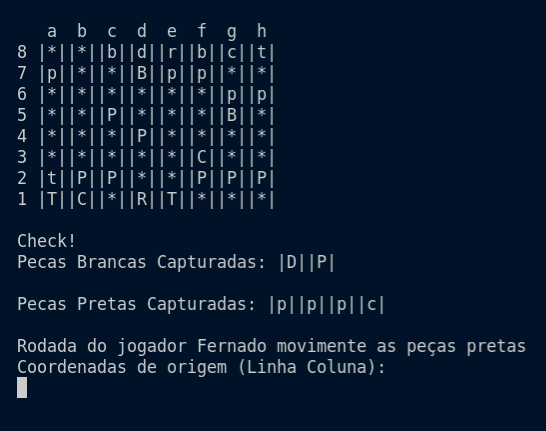

# Projeto-Jogo-De-Xadrez

Projeto de um jogo de xadrez simples implementado em Java usando os conceitos de Programação Orientada à Objetos aprendidos na faculdade.

## Pré-requisitos
Para executar o projeto são necessários alguns requisitos:
- ter o Java JDK instalado em sua máquina. Você pode obte-lo por [aqui](https://www.oracle.com/java/technologies/downloads/).
- ler a documentação do projeto.

## Instruções de execução

Para executar o projeto você deve realizar um clone do repositório para a sua máquina e em seguida compilar todos os arquivos .java localizados na pasta jogoXadrezProjeto-POO, para tanto basta abrir o projeto pelo terminal e utilizar o comando **javac ./jogoXadrezProjeto-POO/**.java e em seguida utilizar o comando **java Gerenciador** para executar o projeto. 

